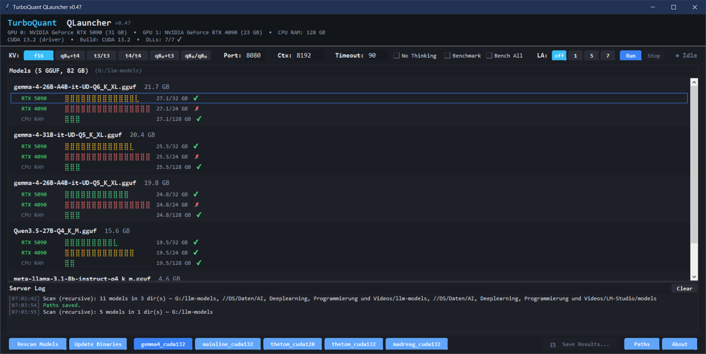

# TurboQuant QLauncher

**Model Switcher & Benchmark Tool for llama-server with TurboQuant Compression**

A lightweight desktop GUI for managing [llama-server](https://github.com/ggml-org/llama.cpp) with [TurboQuant](https://research.google/blog/turboquant-redefining-ai-efficiency-with-extreme-compression/). Launch models, switch KV configs, run benchmarks, monitor VRAM, and quick-switch between multiple llama-server builds — all without touching the command line.

TurboQuant applies Walsh–Hadamard rotation to compress transformer data at very low bit widths. Originally designed for **KV-cache compression**, the community forks are now extending the same WHT rotation to **model weights** (post-training, no retraining required). QLauncher is agnostic to both: any GGUF file, any llama-server build, any cache type.

Zero external dependencies. Python stdlib + tkinter only.



---

## Features

| | Feature | Description |
|---|---|---|
| ⚡ | **One-click Launch** | Double-click any model × GPU row to start llama-server. Double-click again to stop. |
| 📊 | **Live VRAM Bars** | Braille-style bars show effective VRAM usage — updated live when you switch KV config. |
| 🎨 | **KV-aware Colors** | Green = fits. Amber = tight. Red = overflow. Changes with compression selection. |
| 📈 | **Benchmarking** | Built-in llama-bench: single config or full KV × LA × Depth matrix in one run. |
| 🧠 | **Layer-Adaptive** | Modes 1/5/7 keep critical layers at q8_0 for better quality via `TURBO_LAYER_ADAPTIVE`. |
| 📁 | **Bench All** | Matrix benchmark: all KV configs × all LA modes × depth dimension. Stop anytime. Markdown output. |
| ⏱ | **Per-run Timeout** | Configurable timeout per llama-bench invocation prevents Bench All matrices from hanging on a single broken run. |
| 💾 | **Persistent Config** | Window position, KV selection, port, ctx, timeout, model paths, and slot bookmarks saved automatically. |
| 🔍 | **Multi-Directory Scan** | Scan up to **3 separate model directories** for `*.gguf` files, with optional recursive subdirectory walk. Duplicates auto-detected. |
| 🔖 | **Quick-Switch Slots** | Bookmark up to **6 llama-server.exe builds** as one-click footer buttons. Switch between forks instantly. |
| 🖥️ | **Multi-GPU** | NVIDIA, AMD, Intel and Apple Silicon detection. Per-model GPU selector with `CUDA_VISIBLE_DEVICES` routing. |

---

## Quick Start

### Requirements

- **Python 3.10+** (with tkinter — included in standard Windows/macOS installs)
- **llama-server binaries** — QLauncher works with the upstream llama.cpp build *and* with any of the community TurboQuant forks (see [Supported Forks](#supported-forks) below). Bookmark up to 6 builds via the Quick-Switch Slots in the Paths dialog and switch with one click.
- **GGUF models** (e.g. from [Hugging Face](https://huggingface.co/models?search=gguf))
- **NVIDIA GPU** with CUDA 12.x or 13.x — also AMD via ROCm, Intel, and Apple Silicon

### Run

```bash
python TurboQuant_QLauncher.py
```

On first launch, the Paths dialog opens automatically — set your models directory and `llama-server.exe` path.

### Pre-built Binary

A standalone Windows `.exe` (built with [Nuitka](https://nuitka.net/)) is available in [Releases](../../releases). No Python installation required.

---

## Supported Forks

QLauncher is fork-agnostic — it works with any `llama-server.exe` build. The Quick-Switch Slots in the footer let you bookmark up to six different binaries and switch between them with a single click. Useful for A/B-testing optimizations across forks on the same hardware.

The five builds tested with QLauncher:

| Quick-Switch Label | Repository | Branch | Notes |
|---|---|---|---|
| `mainline` | [ggml-org/llama.cpp](https://github.com/ggml-org/llama.cpp) | `master` | Upstream baseline. **No turbo KV types** — only `f16`, `q8_0`, `q4_0`. Use as a control. |
| `thetom` | [TheTom/llama-cpp-turboquant](https://github.com/TheTom/llama-cpp-turboquant) | `feature/turboquant-kv-cache` | The reference TurboQuant integration. Adds `turbo2`/`turbo3`/`turbo4` KV types, Sparse V, weight quantization (TQ3_1S/TQ4_1S). MSVC needs the patches from issue #39. |
| `madreag` | [Madreag/turbo3-cuda](https://github.com/Madreag/turbo3-cuda) | `master` | Aggressive CUDA kernel optimizations on top of the base TurboQuant implementation: LUT scoring, `nthreads_KQ=8`, sparse V skip. Reports +13–69% decode at 32K context across RTX 5090 / 4090 / 3090 / 3090 Ti. |
| `spiritbuun` | [spiritbuun/llama-cpp-turboquant-cuda](https://github.com/spiritbuun/llama-cpp-turboquant-cuda) | `feature/turboquant-kv-cache` | Independent CUDA fork with norm correction and inverse-FWHT prefill optimization. Originally validated on RTX 3090. |
| `gemma4` | [llama-cpp-turboquant-gemma4](https://github.com/test1111111111111112/llama-cpp-turboquant-gemma4) | `master` | Gemma 4-specific turbo4 kernel optimizations for `D=256`/`D=512` head dimensions: lazy K/V, batch decode, warp-cooperative write. Built on top of the TheTom fork. |

> **Tip:** Set `CUDA_DEVICE_ORDER=PCI_BUS_ID` on mixed-architecture systems (e.g. RTX 5090 + RTX 4090). Without it, `CUDA_VISIBLE_DEVICES` can silently route to the wrong GPU. QLauncher does this automatically.

---

## KV-Cache Configurations

| Button | Config | Compression | Best for |
|--------|--------|-------------|----------|
| `f16` | f16 / f16 | 1× (none) | Baseline, maximum quality |
| `q8₀+t4` | q8_0-K + turbo4-V | 2.7× | **Recommended for Q4_K_M models** |
| `t3/t3` | turbo3 / turbo3 | 5× | Maximum context length |
| `t4/t4` | turbo4 / turbo4 | 4× | Good balance |
| `q8₀+t3` | q8_0-K + turbo3-V | 2.9× | High compression, good quality |
| `q8₀/q8₀` | q8_0 / q8_0 | 2× | Standard 8-bit quantization |

The VRAM bars and ✓/✗ indicators update live as you click KV buttons.

---

## Layer-Adaptive Modes

| LA | Strategy | Use case |
|----|----------|----------|
| `off` | All layers equally compressed | Maximum compression |
| `1` | First 4 + last 4 layers at q8_0 | **Best quality** (recommended) |
| `5` | Aggressive compression | 128K context on 24 GB |
| `7` | First 2 + last 2 V-cache at q8_0 | Minimal VRAM overhead |

LA modes have negligible speed impact (<1%) — the benefit is output quality. LA=1 also provides slightly better decode speed due to native int8 dp4a at critical layers.

---

## Beyond KV-Cache — Weight Compression

TurboQuant is no longer just a KV-cache technique. The same Walsh–Hadamard rotation that powers `turbo3` / `turbo4` cache types is now being applied to **model weights** as a post-training quantization method, producing new `TQ3_1S` (3-bit, ~4.0 bpw) and `TQ4_1S` (4-bit, ~5.0 bpw) tensor types. No retraining, no calibration data — just `llama-quantize --allow-requantize`.

QLauncher needs no changes for this: weight-compressed models are just GGUF files with different tensor types. Drop them into any model directory and they show up in the scan like everything else.

> 📅 **As of April 2026** — Metal kernels are landing first, CUDA ports are in flight. Early PR #45 numbers show Qwen 3.5 27B dropping from ~26.6 GB to ~19.1 GB at +1.3 % PPL on Metal, while the CUDA path is still running at roughly 70 % of `q8_0` decode speed while kernels are being tuned. Track the implementation progress on [TheTom/llama-cpp-turboquant PR #45](https://github.com/TheTom/llama-cpp-turboquant/pull/45) and in [Discussion #20969](https://github.com/ggml-org/llama.cpp/discussions/20969) — both move daily.

---

## Controls

| Action | Effect |
|--------|--------|
| **Double-click** row | Launch server (or stop if running) |
| **Single click** | Select model / GPU without launching |
| **↑ ↓ / ← →** | Navigate models / GPUs |
| **Enter** | Toggle server for selected row |
| **Escape** | Stop running server |
| **Click status label** | Open `http://localhost:{port}` in browser |
| **Run / Stop** | Start or cancel benchmark |
| **LA: off/1/5/7** | Select Layer-Adaptive mode |
| **☑ Bench All** | Select all KV × LA configs, then click Run |

---

## Benchmark Output

Results are saved as Markdown tables to `TurboQuant_Benchmark_results.md` — ready for GitHub posts:

```markdown
### model.gguf — RTX 4090, Build CUDA 12.8 (sm_89;120), Driver 13.2, 2026-04-04

| KV-Cache          | pp512 (t/s) | tg128 (t/s) | Δ Prefill | Δ Decode |
|-------------------|-------------|-------------|-----------|----------|
| **LA=off**        |             |             |           |          |
| f16 (default)     | 10,112.60   | 150.59      | —         | —        |
| q8_0-K + turbo4-V | 10,808.36   | 136.37      | +6.9%     | -9.4%    |
| ...               |             |             |           |          |
```

Each run includes model name, GPU, CUDA build version (sm targets), driver version, and timestamp.

---

## Benchmark Findings

> 📅 **Snapshot: April 2026** — The numbers below are a point-in-time capture from a single hardware setup and a single fork build. TurboQuant kernels are being tuned weekly across all five forks, so individual figures and the "best config" recommendation can and will move. Use this as a reference shape, not as a current ranking. For the latest community results check [Discussion #20969](https://github.com/ggml-org/llama.cpp/discussions/20969).

Tested on AMD 9950X3D · 64 GB DDR5 · RTX 5090 (32 GB) + RTX 4090 (24 GB).
Build: spiritbuun `feature/turboquant-kv-cache` · CUDA 12.8 · `-DGGML_CUDA_FA=ON -DGGML_CUDA_FA_ALL_QUANTS=ON`.

### Key Results — Meta-Llama-3.1-8B-Instruct-Q4_K_M · LA=1

| Config | RTX 4090 (Ada, sm_89) | RTX 5090 (Blackwell, sm_120) |
|---|---|---|
| f16 baseline | 10,077 / 150.2 t/s | 12,761 / 231.9 t/s |
| q8₀+t4 | +8.7% / **-6.9%** | -3.2% / **-25.2%** |
| q8₀+t3 | +8.5% / **-8.2%** | -2.7% / **-30.2%** |
| t3/t3 | +3.8% / **-14.9%** | -7.5% / **-39.7%** |

### Notable Findings

- **Ada (sm_89) currently handles TurboQuant decode significantly better than Blackwell (sm_120).** In this snapshot the RTX 4090 loses only ~7 % decode with q8₀+t4, while the RTX 5090 loses ~25 %. This matches the structural explanation that Ada's int8 `dp4a` instructions align well with the current TurboQuant dequant path — but Blackwell-specific kernels are an active work item, so expect this gap to close.
- **LA=1 improves decode speed in addition to quality** on this build. The q8_0 layers at critical positions use the faster native int8 decode.
- **CUDA 12.8 ≈ CUDA 13.2 on this hardware** for TurboQuant workloads. `sm_120a` provided no measurable benefit over `sm_120` in our test runs.
- **Working recommendation on this setup:** `q8_0-K + turbo4-V` with `LA=1` — best balance of compression, speed, and quality *at the time of measurement*. Re-run the Bench All matrix after any fork update.

---

## Building llama-server

The build flags below work for **any** of the supported TurboQuant forks. Just substitute the repository URL and branch from the [Supported Forks](#supported-forks) table. The example uses the spiritbuun fork:

```cmd
git clone --branch feature/turboquant-kv-cache --depth 1 ^
  https://github.com/spiritbuun/llama-cpp-turboquant-cuda.git

cd llama-cpp-turboquant-cuda

cmake -B build -DGGML_CUDA=ON -DGGML_NATIVE=ON ^
  -DGGML_CUDA_FA=ON -DGGML_CUDA_FA_ALL_QUANTS=ON ^
  -DCMAKE_CUDA_ARCHITECTURES="89;120" ^
  -DCMAKE_BUILD_TYPE=Release

cmake --build build --config Release -j
```

`CMAKE_CUDA_ARCHITECTURES="89;120"` builds for Ada (RTX 4090, sm_89) **and** Blackwell (RTX 5090, sm_120) in one binary. Drop one of the values if you only need a single architecture.

After building, place each `llama-server.exe` (and the matching `ggml-*.dll` / `llama.dll` files) into its own folder, then add the folder to a Quick-Switch slot in QLauncher → Paths.

> 📅 **MSVC note (as of April 2026):** Building the TheTom fork on Windows currently needs a handful of manual patches (`M_PI` define, `extern` visibility fixes, etc.). Add `#define _USE_MATH_DEFINES` and `#include <math.h>` at the top of `ggml/src/ggml-turbo-quant.c` and see [issue #39](https://github.com/TheTom/llama-cpp-turboquant/issues/39) for the full set. These are likely to land upstream at some point — check the issue status before patching.

> **Multi-GPU note:** Set `CUDA_DEVICE_ORDER=PCI_BUS_ID` for correct GPU routing on mixed-architecture systems. QLauncher does this automatically for every server it launches.

---

## Related Projects

**Forks tested with QLauncher:**

- [ggml-org/llama.cpp](https://github.com/ggml-org/llama.cpp) — Upstream llama.cpp (mainline baseline)
- [TheTom/llama-cpp-turboquant](https://github.com/TheTom/llama-cpp-turboquant) — Reference TurboQuant integration (`feature/turboquant-kv-cache`)
- [Madreag/turbo3-cuda](https://github.com/Madreag/turbo3-cuda) — Aggressive CUDA kernel optimizations
- [spiritbuun/llama-cpp-turboquant-cuda](https://github.com/spiritbuun/llama-cpp-turboquant-cuda) — Independent CUDA fork with norm correction
- [llama-cpp-turboquant-gemma4](https://github.com/test1111111111111112/llama-cpp-turboquant-gemma4) — Gemma 4 D=256/512 head optimizations

**Other resources:**

- [TheTom/turboquant_plus](https://github.com/TheTom/turboquant_plus) — TurboQuant research workspace (benchmarks, quality validation, writeups)
- [Discussion #20969](https://github.com/ggml-org/llama.cpp/discussions/20969) — Community benchmarks & findings

---

## Acknowledgements

- **spiritbuun** — TurboQuant CUDA kernels, norm correction, fused FA
- **TheTom** — turboquant_plus, block_size=128 optimization, Metal support
- **seanrasch** — Ampere benchmarks, 256K context dual-GPU validation
- **AmesianX** — Blackwell / TurboQuant v1.4.0, IWHT FP16 bug fix
- **primoco** — Accuracy benchmarks (100% math accuracy with q8_0-K/tq4_0-V)

TurboQuant refers to the paper by Zandieh et al. ([arXiv:2504.19874](https://arxiv.org/abs/2504.19874), ICLR 2026, Google Research). This tool is an independent community project, not affiliated with Google.

---

## License

MIT — © WaveboSF 2026

Built with assistance from Claude (Anthropic).
